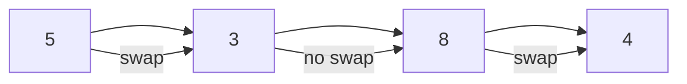

# 🔢 Data Structures Lab – Sorting Algorithms (Java)

---

## 📺 Lecture Video

### 🎥 Sorting & Selection Lab Lecture

👉 

---

## 🧠 Introduction to Sorting Algorithms

**Sorting algorithms** rearrange elements in a collection (usually an array) into a specific order, most commonly **ascending** or **descending**.

Sorting is one of the **most fundamental problems in computer science** and is a prerequisite for many efficient algorithms.

> 💡 This lecture brings together **arrays, recursion, trees, and algorithmic thinking**, making it the perfect conclusion to the semester.

---

## ❓ Why Do We Need Sorting?

Many algorithms **assume sorted input** to achieve optimal performance.

### ✅ Examples:

* **Binary Search** → requires sorted arrays to run in `O(log n)`
* **Merge Intervals** → sorting simplifies overlap detection
* **Finding Median / Percentiles** → easier on sorted data
* **Duplicate Removal** → adjacent comparison after sorting
* **Databases & Indexing** → rely heavily on sorted structures

> Without sorting, many problems degrade from efficient solutions to brute force.

---

## 📘 Classification of Sorting Algorithms

Sorting algorithms can be classified based on several criteria:

### 🔍 By Comparison

* **Comparison-based**: Bubble, Selection, Insertion, Merge, Quick
* **Non-comparison-based**: Counting, Radix (not covered here)

### 💾 By Memory Usage

* **In-place**: Bubble, Selection, Insertion, Quick
* **Not in-place**: Merge

### 🔁 By Stability

* **Stable**: Bubble, Insertion, Merge
* **Unstable**: Selection, Quick

---

## 🔁 4. Bubble Sort

### 📌 Idea

Repeatedly compare adjacent elements and swap them if they are in the wrong order.

Large elements "bubble" to the end of the array.

### 🧠 Key Properties

* Simple and intuitive
* Inefficient for large datasets

### ⏱ Complexity

| Case    | Time  |
| ------- | ----- |
| Best    | O(n)  |
| Average | O(n²) |
| Worst   | O(n²) |

### 💾 Space

* O(1) (in-place)

### 🔒 Stability

* ✅ Stable

### Diagram Example:

---

## 🧲 5. Selection Sort

### 📌 Idea

Repeatedly select the minimum element from the unsorted part and move it to the front.

### 🧠 Key Properties

* Minimal number of swaps
* Always performs the same number of comparisons

### ⏱ Complexity

| Case    | Time  |
| ------- | ----- |
| Best    | O(n²) |
| Average | O(n²) |
| Worst   | O(n²) |

### 💾 Space

* O(1)

### 🔒 Stability

* ❌ Not stable

---

## ✋ 6. Insertion Sort

### 📌 Idea

Builds the sorted array one element at a time by inserting elements into their correct position.

### 🧠 Key Properties

* Very efficient for nearly sorted arrays
* Commonly used in hybrid algorithms

### ⏱ Complexity

| Case    | Time  |
| ------- | ----- |
| Best    | O(n)  |
| Average | O(n²) |
| Worst   | O(n²) |

### 💾 Space

* O(1)

### 🔒 Stability

* ✅ Stable

---

## 🔀 7. Merge Sort

### 📌 Idea

Uses **divide and conquer**:

1. Divide the array into halves
2. Sort each half recursively
3. Merge the sorted halves

### 🧠 Key Properties

* Predictable performance
* Suitable for large datasets

### ⏱ Complexity

| Case    | Time       |
| ------- | ---------- |
| Best    | O(n log n) |
| Average | O(n log n) |
| Worst   | O(n log n) |

### 💾 Space

* O(n)

### 🔒 Stability

* ✅ Stable

---

## ⚡ 8. Quick Sort

### 📌 Idea

Select a **pivot** element and partition the array:

* Elements smaller than pivot → left
* Elements larger than pivot → right

Recursively sort partitions.

### 🧠 Key Properties

* Very fast in practice
* Performance depends on pivot choice

### ⏱ Complexity

| Case    | Time       |
| ------- | ---------- |
| Best    | O(n log n) |
| Average | O(n log n) |
| Worst   | O(n²)      |

### 💾 Space

* O(log n) (recursion stack)

### 🔒 Stability

* ❌ Not stable

---

## 📊 9. Comparison Summary Table

| Algorithm | Best       | Average    | Worst      | Stable | In-Place |
| --------- | ---------- | ---------- | ---------- | ------ | -------- |
| Bubble    | O(n)       | O(n²)      | O(n²)      | ✅      | ✅        |
| Selection | O(n²)      | O(n²)      | O(n²)      | ❌      | ✅        |
| Insertion | O(n)       | O(n²)      | O(n²)      | ✅      | ✅        |
| Merge     | O(n log n) | O(n log n) | O(n log n) | ✅      | ❌        |
| Quick     | O(n log n) | O(n log n) | O(n²)      | ❌      | ✅        |

---

## 🧪 10. Student Practice Tasks

> ❗ No solutions are provided.

* Implement each algorithm manually
* Count comparisons and swaps
* Test algorithms on nearly sorted arrays
* Identify stable vs unstable behavior

---

## 🎓 Learning Outcomes

By the end of this lab, students will:

- Understand stable vs unstable sorting
- Know in-place vs extra memory algorithms
- Implement common sorting algorithms
- Analyze time & space complexity
- Solve selection problems efficiently
- Connect sorting to arrays, recursion, and trees

---

## 🏁 11. End of Semester Note 🎓✨

> 🎉 Congratulations! You have reached the **final lecture of the semester**.
>
> By mastering these **sorting and selection algorithms**, you now have a **strong and practical foundation in core data structures and algorithmic thinking**.
> 
> 💡 These skills will empower you to tackle **advanced data structures, algorithmic challenges, and real-world coding problems** with confidence.
> 
> 🔍 Remember: practice is key! Trace examples manually, draw diagrams, and visualize algorithms step by step to **fully internalize the concepts**.
> 
> 🌱 Learning doesn’t stop here — sorting is just the beginning of efficient problem-solving in computer science.

## 💬 Final Word from Your Instructor (Maryam Refaa Haidar Skaik):

*"I am incredibly proud of your progress this semester. Every loop, recursion, and tree traversal you implemented has built your algorithmic thinking. Keep exploring, keep coding, and always stay curious. Remember, the world of data structures is vast, and your journey has only just begun! 🌟"*

---

## 📝 13. License

This repository is provided strictly for **educational purposes** as part of the **Java Data Structures Lab**.
